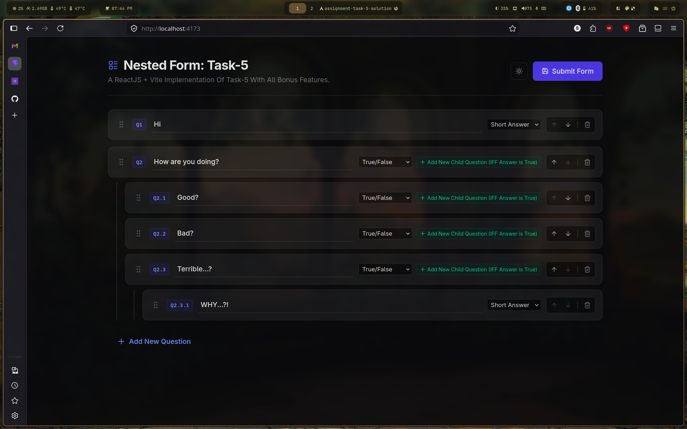
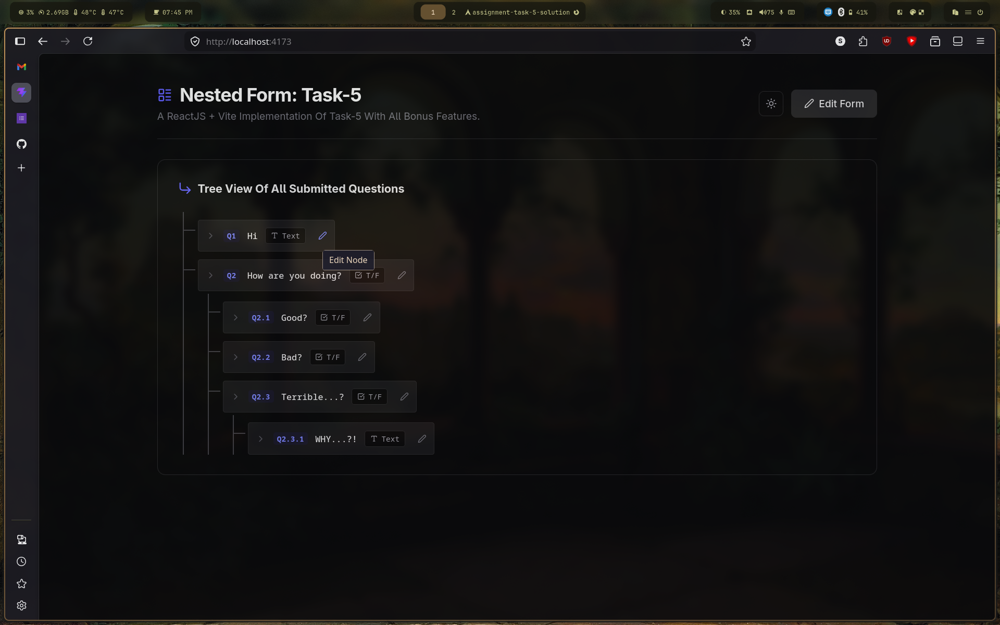

# React + Vite Implementation Of Task-5

This implementation has all the optional bonus features mentioned in the problem statement, along with some stylizations made to make the website look more polished.

# How To Run Locally

To run this locally, just get `npm` on your system and run the following commands inside the root directory of the project:

```
npm install
npm run build
npm run preview
```

And then open the web browser and go to the specified localhost address mentioned in the terminal upon running the last command.
The output should be something like this:




